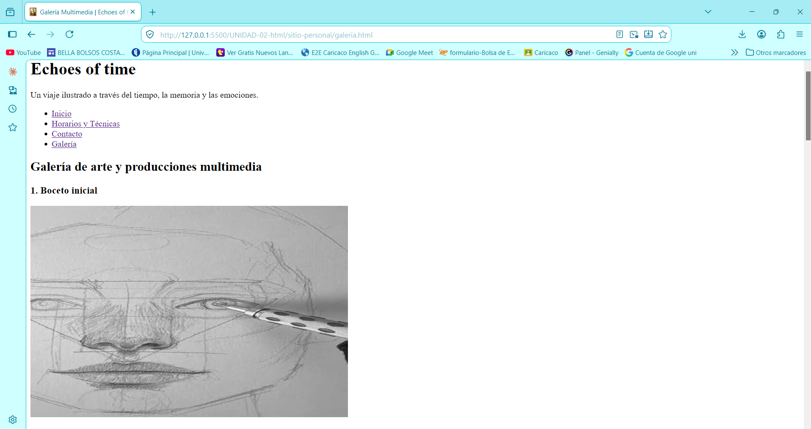

<div align="center" markdown="1"> 

# 📘 Portafolio de Evidencias

### Dayanna Sanchez Jimenez

**CSTI12002 · Codificación de páginas web** · Instituto Nacional de Aprendizaje
Facilitador: Giovanni Antonio Coto Calderón · Edición 2 · 2026


</div>

---

## 📖 Sobre este portafolio

Este repositorio reúne el trabajo realizado durante las 150 horas del módulo
**Codificación de páginas web**. Cada carpeta corresponde a una unidad de aprendizaje
y contiene las prácticas de sus sesiones. El registro de evidencias, más abajo,
documenta sesión por sesión qué se hizo y qué se aprendió.

> Recorrido sugerido: empezar por el registro de evidencias y abrir los enlaces
> de las sesiones que interesen. La galería de capturas muestra los resultados
> más representativos.

---

## 📁 Estructura del repositorio

```
Portafolio-Codificación de Páginas Web/
├── README.md               ← este archivo
├── recursos/               ← capturas de pantalla y material de apoyo
├── unidad-01/              ← Control de versiones
├── unidad-02/              ← Etiquetas y atributos HTML
├── unidad-03/              ← Codificación de hojas de estilo
├── unidad-04/              ← Páginas web responsivas
└── unidad-05/              ← Frameworks y librerías
```

---

## 📋 Registro de evidencias

### Unidad 1 · Implementación de control de versiones

| Sesión | Tema         | Qué aprendí   |      Trabajo      |     Captura      |
| :----: | :----------- | :--------------------------------------------------------------------------------------------------------------------------------------------------------------------------------------------------------------------------------------------- | :---------------: | :--------------: |
|  S01   | Git y GitHub | Inicialización de repositorios locales mediante Git -Conexión del repositorio local con GitHub, repositorio remoto -Configuración inicial para el control de versiones -Establecimiento de buenas prácticas de commits para el desarrollo web. | [ver](UNIDAD-01-control-de-versiones/1.Guia_GitHub_Interfaz_Herramientas.pdf)<br>[ver](UNIDAD-01-control-de-versiones/2.DESARROLLO-MarcoTeórico-Sesion1-2.pdf)<br>[ver](UNIDAD-01-control-de-versiones/2.Tarjeta_Bolsillo_Git_GitHub.pdf)<br>[ver](UNIDAD-01-control-de-versiones/ControlDeCambios_Unidad%20de%20Aprendizaje%20N1.pdf) | [ver](recursos/S01-Evidencia-estructura.portafolio.png) |

<details  markdown="1"> 
<summary><b>Unidad 2 · Etiquetas y atributos HTML</b> (sesiones 2 a 8)</summary>

| Sesión | Tema        | Qué aprendí   |    Trabajo        |     Captura      |
| :----: | :----------------------------- | :------------------------------------------------------------------------------------------------------------------------------------------------------------------------------------------------------------------------------------------------------------------------------------------------------------------------------------------------------ | :---------------: | :-------------------------------------------------------------------------------------------------------------------------------------------------------: |
|  S02   | Git colaborativo, la web y XML | Aprendi sobre comandos git para trabajo colaborativo.| [ver](recursos/s02-trabajo-colaborativo.png) | [ver](recursos/s02-proyecto-colaborativo.png)|
|  S03   | Estructura del documento HTML5 |Trabajamos en grupo en creación de páginas en formato html y trabajo colaborativo en Github | [ver](re) | [ver](recursos/Grafico-de-trabajo-colaborativo.S03.png)|
|  S04   | Texto, enlaces y anclas| Agregamos el favicon y los metadatos de una pagina personales.Y profundizamos en la estructura y organización de documentos HTML mediante la implementación de etiquetas semánticas, mejorando la accesibilidad y el orden lógico del sitio. Asimismo, integramos enlaces de tipo ancla para optimizar la navegación interna dentro de la misma página. | [ver](UNIDAD-02-html/Sitio.demo/articulo.html) | [ver](/recursos/Evidencia-favicon.png)|
|  S05   | Listas y tablas|Aprendi a trabajar los 3 tipos de listas con sus tipos y estilo. tambien la parte de tablas semánticas.| [ver](UNIDAD-02-html/Sitio.demo/horarios.html) | [ver](recursos/S05-listas-y-tablas.png)|
|  S06   | Formularios y semántica | Aprendimos realizar etiquetas, formulario y validación local de formulario. | [ver](UNIDAD-02-html/Sitio.demo/registro.html) |[ver](recursos/S06-Evidencia-formulario-semantica.png)|
|  S07   | Multimedia|Aprendi a realizar etiquetas, controles de audio y video,formatos y portadas y subtítulos.| [ver](UNIDAD-02-html/Sitio.demo/galeria.html) |[ver](recursos/S.07-multimedia.png)|
|  S08   | SVG y repaso | Aprendi a realizar pagina de insignia html con estructura y ala vez repasamos conceptos y practicas dadas | [ver](UNIDAD-02-html/Sitio.demo/insignia.html) |[ver](recursos/S08-svg-html.png)|

<!--
  ─────────────────────────────────────────────────────────────────────
  DÓNDE PEGAR ESTO

  Dentro del bloque <details> de la Unidad 2 que YA existe,
  DESPUÉS de la tabla de sesiones que ya está completada
  y ANTES de la línea que cierra:  </details>

  No borres nada de lo que ya tienes escrito.
  ─────────────────────────────────────────────────────────────────────
-->

---

### El sitio personal

Proyecto propio construido de forma autónoma.
**Tema del sitio:** _Galería de arte y taller interactivo "Echoes of Time_

| Página | Qué contiene | Sesiones aplicadas | Ver | Validación |
|:-------|:-------------|:------------------:|:---:|:----------:|
| `index.html` | Estructura semántica, metadatos, texto jerarquizado, citas, enlaces y anclas | S03 · S04 · S06 | [ver](UNIDAD-02-html/sitio-personal/index.html) | [ver](recursos/sp-validacion-index.png) |
| `listas.html` | Las tres listas, lista anidada y tabla con celdas combinadas | S05 | [ver](UNIDAD-02-html/sitio-personal/listas.html) | [ver](recursos/sp-validacion-listas.png) |
| `contacto.html` | Formulario con ocho campos y validación de HTML | S06 | [ver](UNIDAD-02-html/sitio-personal/contacto.html) | [ver](recursos/sp-validacion-contacto.png) |
| `galeria.html` | Imágenes, audio, video con subtítulos y gráficas SVG | S07 · S08 | [ver](UNIDAD-02-html/sitio-personal/galeria.html) | [ver](recursos/sp-validacion-galeria.png) |

**Decisiones que tomé**

| Decisión | Qué elegí | Por qué |
|:---------|:----------|:--------|
| Tema del sitio | Galeria de arte e ilustración *Echoes of Time| Permite integrar contenido visua, como archivo multimedias y estructuras con horarios de talleres de forma orgánica. |
| Atributo de la lista ordenada | `reversed` y `type="1"` | Para mostrar la secuencia cronológica de eventos artísticos desde la edición más reciente hacia la más antigua.|
| Formatos de imagen usados | `WebP` como primera opción e `JPEG` / `PNG` de respaldo| Porque maximiza la velocidad de carga manteniendo alta fidelidad de color en las acuarelas. |
| Formas del gráfico SVG | `<rect>`, `<circle>`, `<polygon>`, `<line>` y `<text>` | Esto combinadas crean un isotipo geométrico representativo del taller sin depender de archivos de imagen externos. |

**Cómo se ve**

<p align="center">
  
</p>

<div align="center" markdown="1">

*Portada del sitio personal al cerrar la Unidad 2.*

</div>

**Comprobado en dos navegadores:**
[Chrome](recursos/sp-navegador-chrome.png) · [Firefox](recursos/sp-navegador-firefox.png)

</details>

<details  markdown="1"> 
<summary><b>Unidad 3 · Codificación de hojas de estilo</b> (sesiones 11 a 20)</summary>

| Sesión | Tema                       | Qué aprendí |      Trabajo      |     Captura      |
| :----: | :------------------------- | :---------- | :---------------: | :--------------: |
|  S11   | Introducción a CSS         | Introducción a CSS, sintaxis y validación| [ver](UNIDAD-03-css/sitio-personal/index.html) | [ver](recursos/s11-stilos-css.png) |
|  S12   | Selectores y pseudo-clases | A integrar los selectores,pseudo-clases, pseudo-elementos y introducción ala tipografia | [ver](UNIDAD-03-css/sitio-personal/index.html) | [ver](recursos/s12-selectores.png) |
|  S13   | Tipografía y color         | Aprendi a integrar tipografia avanzada,color y fondos.      | [ver](UNIDAD-03-css/sitio-personal/index.html) | [ver](recursos/S13-tipografia-fondos.png) |
|  S14   | Modelo de cajas            | Trabajamos margin,box-sizing| [ver](UNIDAD-03-css/sitio-personal/index.html) | [ver](recursos/s14.modelo-cajas.png) |
|  S15   | Display y posicionamiento  | Trabajamos integración de display y position(static-relative-absolute.fixed/sticky)| [ver](UNIDAD-03-css/sitio-personal/galeria.html) | [ver](recursos/s15.display-position.png) |
|  S16   | Flexbox                    | Trabajamos propiedades de flexbox para posicionar cajas y sus elementos            | [ver](UNIDAD-03-css/Sitio.demo/galeria.html) | [ver](recursos/S16-flexbox.png) |
|  S17   | CSS Grid                   |Trabajamos en la integración de grid template | [ver](UNIDAD-03-css/sitio-personal/galeria.html) | [ver](recursos/s17-grid-sp.png) |
|  S18   | Componentes estilizados    |             | [ver](UNIDAD-03-css/) | [ver](recursos/) |
|  S19   | Animaciones y filtros      |             | [ver](UNIDAD-03-css/) | [ver](recursos/) |
|  S20   | SCSS y repaso              |             | [ver](UNIDAD-03-css/) | [ver](recursos/) |

</details>

<details  markdown="1"> 
<summary><b>Unidad 4 · Páginas web responsivas</b> (sesiones 23 a 28)</summary>

| Sesión | Tema                            | Qué aprendí |      Trabajo      |     Captura      |
| :----: | :------------------------------ | :---------- | :---------------: | :--------------: |
|  S23   | Viewport y anchos fluidos       |             | [ver](unidad-04/) | [ver](recursos/) |
|  S24   | Media queries y mobile-first    |             | [ver](unidad-04/) | [ver](recursos/) |
|  S25   | Menú responsivo e impresión     |             | [ver](unidad-04/) | [ver](recursos/) |
|  S26   | Imágenes y video adaptativos    |             | [ver](unidad-04/) | [ver](recursos/) |
|  S27   | Patrones de diseño adaptativo I |             | [ver](unidad-04/) | [ver](recursos/) |
|  S28   | Patrones II y repaso            |             | [ver](unidad-04/) | [ver](recursos/) |

</details>

<details  markdown="1"> 
<summary><b>Unidad 5 · Frameworks y librerías</b> (sesiones 31 a 36)</summary>

| Sesión | Tema                          | Qué aprendí |      Trabajo      |     Captura      |
| :----: | :---------------------------- | :---------- | :---------------: | :--------------: |
|  S31   | Librerías y frameworks        |             | [ver](unidad-05/) | [ver](recursos/) |
|  S32   | Sistema de rejilla I          |             | [ver](unidad-05/) | [ver](recursos/) |
|  S33   | Sistema de rejilla II         |             | [ver](unidad-05/) | [ver](recursos/) |
|  S34   | Tipografía y utilidades       |             | [ver](unidad-05/) | [ver](recursos/) |
|  S35   | Formularios y navegación      |             | [ver](unidad-05/) | [ver](recursos/) |
|  S36   | Componentes y personalización |             | [ver](unidad-05/) | [ver](recursos/) |

</details>

---

## 🖼 Galería de capturas

_(Sustituir por las capturas propias. Se recomienda incluir de tres a seis
imágenes representativas de todo el módulo.)_

<p align="center">
  
</p>

<div align="center" markdown="1"> <i>El sitio personal al cierre de la Unidad 3.</i></div>

### El mismo sitio en dos anchos

|                             Móvil (375 px)                              |                               Escritorio (1280 px)                                |
| :---------------------------------------------------------------------: | :-------------------------------------------------------------------------------: |
|  |  |

---

## 🎨 Decisiones técnicas documentadas

_(Completar conforme avanza el módulo. Ejemplos de lo que corresponde anotar aquí.)_

| Decisión                       | Qué elegí | Por qué |
| :----------------------------- | :-------- | :------ |
| Puntos de quiebre              |           |         |
| Patrones de diseño adaptativo  |           |         |
| Método de enlace del framework |           |         |

---

## 💭 Reflexión final

_(Escribir al cerrar el módulo. Tres preguntas para orientarla:)_

1. ¿Qué sé hacer hoy que no sabía el primer día?
2. Comparando mi sitio hecho a mano con el que construí con framework:
   ¿qué fue más rápido, qué quedó más bajo mi control y cuándo usaría cada enfoque?
3. ¿Qué me propongo seguir aprendiendo por mi cuenta?

---

## 🛠 Herramientas empleadas

- **Editor:** Visual Studio Code con Live Server y Prettier
- **Control de versiones:** Git y GitHub
- **Lenguajes:** HTML5, CSS3, XML, SVG
- **Framework:** Bootstrap 5 y Bootstrap Icons
- **Validadores:** W3C Markup Validation Service y CSS Jigsaw
- **Preprocesador:** SCSS/Sass

---

<div align="center" markdown="1"> 

**Dayanna Sanchez Jimenez** · daya20sanchez@gmail.com

Portafolio elaborado durante el módulo CSTI12002 · Instituto Nacional de Aprendizaje · 2026

</div>
